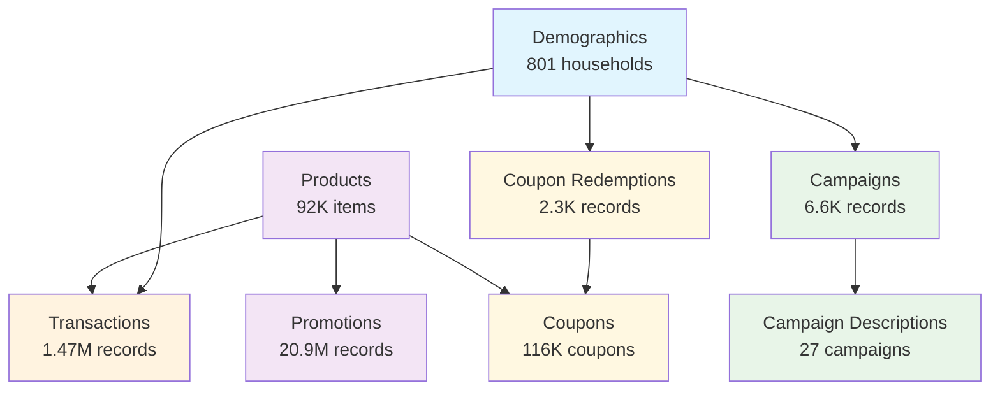

# Complete Journey Python

*A comprehensive Python data package for grocery store transaction analysis*

[](https://python.org)
[](https://github.com/jamescunningham/completejourney_py)
[](https://opensource.org/licenses/MIT)
[](https://github.com/psf/black)
[](http://mypy-lang.org/)

## Overview

The Complete Journey Python package provides easy access to comprehensive grocery store transaction data from [84.51°](http://www.8451.com/area51/). This dataset represents a complete view of household shopping behavior over one full year, making it invaluable for retail analytics education, learning customer behavior analysis techniques, and advanced data science coursework.

!!! warning "Simulated Data Notice"
    **This package contains simulated data for educational purposes only.** While based on realistic shopping patterns, this is not real consumer data. Use for learning, tutorials, and skill development - not for research or commercial purposes.

!!! info "Dataset Scale"
    - **1,469,307** transaction records
    - **801** households tracked
    - **8** interconnected datasets
    - **1 full year** of shopping data

## What Makes This Dataset Special

The Complete Journey dataset stands out in the retail analytics space because it provides:

- **Complete Transaction History**: Unlike many datasets that focus on specific categories, this includes all grocery purchases
- **Household-Level Tracking**: Follow individual households over time to understand shopping patterns
- **Marketing Integration**: Includes campaign data, coupon usage, and promotional information
- **Demographic Context**: Household characteristics to understand customer segments

## Key Use Cases

### 🛒 **Retail Analytics**
- Market basket analysis
- Customer lifetime value calculation
- Product performance analysis
- Seasonal trend identification

### 📊 **Customer Behavior Research**
- Shopping frequency patterns
- Brand loyalty analysis
- Price sensitivity studies
- Demographic shopping differences

### 🎯 **Marketing Effectiveness**
- Campaign performance measurement
- Coupon redemption analysis
- Promotional impact assessment
- Customer segmentation

### 🎓 **Academic Coursework**
- Consumer behavior exercises
- Retail economics illustrations
- Marketing analytics education
- Data science coursework

## Quick Start

Get started with Complete Journey data in just a few lines:

```python
from completejourney_py import get_data

# Load all datasets
data = get_data()

# Access transaction data
transactions = data["transactions"]
print(f"Loaded {len(transactions):,} transaction records")

# Basic analysis
top_products = (transactions
    .groupby('product_id')['sales_value']
    .sum()
    .sort_values(ascending=False)
    .head(10))
```

## Dataset Overview

The Complete Journey package includes eight interconnected datasets:

| Dataset | Records | Description |
|---------|---------|-------------|
| **transactions** | 1.47M | Individual product purchases with prices, quantities, and timing |
| **demographics** | 801 | Household characteristics including age, income, and composition |
| **products** | 92K | Product metadata with categories, brands, and descriptions |
| **campaigns** | 6.6K | Marketing campaigns received by households |
| **campaign_descriptions** | 27 | Campaign metadata and details |
| **promotions** | 20.9M | Product placement in mailers and stores |
| **coupons** | 116K | Coupon metadata with values and restrictions |
| **coupon_redemptions** | 2.3K | Individual coupon usage records |

## Data Relationships



## What's Next?

- **[Getting Started](user-guide/getting-started.md)** - Installation and basic usage
- **[Dataset Guide](user-guide/datasets.md)** - Detailed exploration of each dataset
- **[Cookbook](cookbook/top-products.ipynb)** - Step-by-step analysis examples
- **[API Reference](api/get_data.md)** - Complete function documentation

## Data Source & Citation

**Important**: This package contains **simulated data for educational purposes only**. The data structure and concepts are based on the original Complete Journey dataset from [84.51°](http://www.8451.com/area51/), but the actual data has been simulated for learning purposes.

**Appropriate for:**

- 🎓 Educational coursework and tutorials
- 📊 Learning data analysis techniques
- 🚀 Prototyping and skill development
- 📝 Teaching retail analytics concepts

**Not appropriate for:**

- 🚫 Academic research requiring real data
- 🚫 Commercial business decisions
- 🚫 Publication in research journals

When using this educational dataset, please cite:

> 84.51°. (2015). *The Complete Journey: A comprehensive view of household shopping behavior* [Dataset concept]. 84.51°. http://www.8451.com/area51/  
> *Note: This implementation contains simulated data for educational purposes.*

## Related Resources

- [Original R Package](https://github.com/bradleyboehmke/completejourney) - The original implementation
- [Complete Journey Analysis](https://bradleyboehmke.github.io/completejourney/) - Detailed exploration by the R package author
- [84.51° Website](http://www.8451.com/) - The data provider's main site